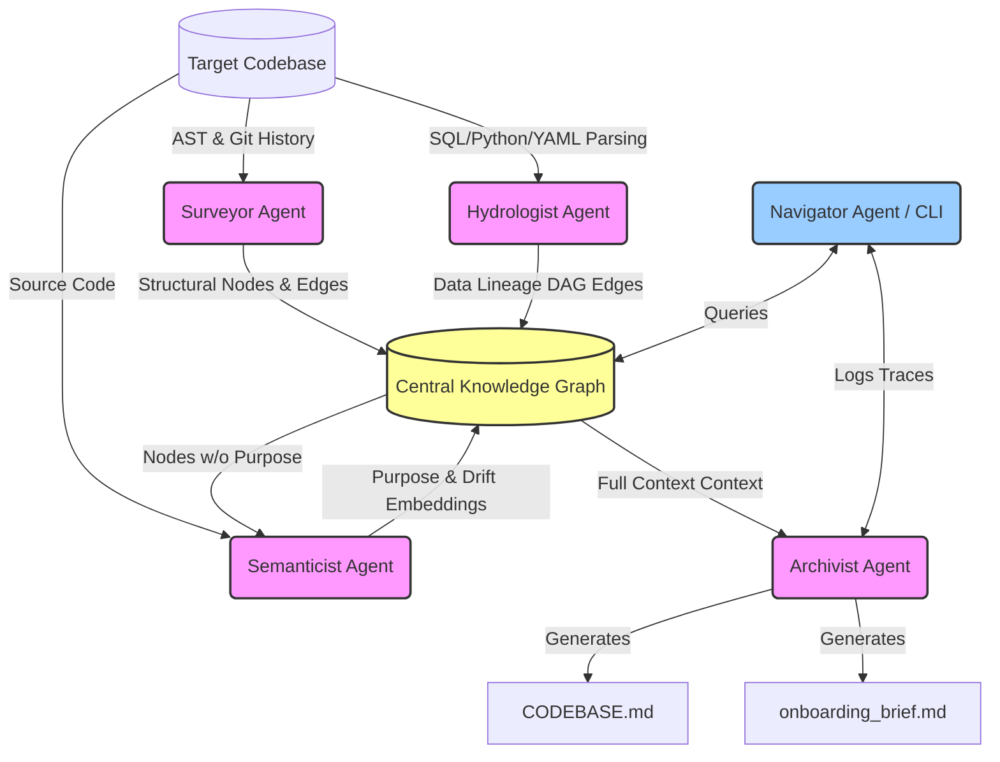

# The Brownfield Cartographer: Final FDE Report

This report evaluates the Brownfield Cartographer pipeline against the five core assessment criteria, demonstrating its efficacy as a Day-One forward deployment enablement tool. The target used for this evaluation is the representative `jaffle_shop` dbt project.

---

## 1. Manual Reconnaissance Depth

Prior to running the Cartographer, I performed a manual analysis of the `jaffle_shop` repository to establish a ground-truth understanding of the codebase and document the friction points an FDE faces.

**The Five Day-One Questions (Manual Findings):**
1. **Primary Ingestion Path**: The project ingests data primarily via dbt seeds (`raw_customers.csv`, `raw_orders.csv`, `raw_payments.csv`), which are referenced using `{{ ref() }}` in the staging layer (`models/staging/`).
2. **Critical Output Datasets**: The two main sinks are `customers` (aggregating lifetime metrics) and `orders` (flattening order and payment data).
3. **Blast Radius of Most Critical Module**: `stg_orders` is a critical hub. If it fails, downstream models `orders.sql` and `customers.sql` both fail, breaking the core business reporting tables.
4. **Business Logic Distribution**: Technical cleaning (type casting, renaming) is concentrated in the staging layer (`models/staging/`), while heavy business logic (customer lifetime value, payment pivots) is concentrated in the core layer (`models/`).
5. **High-Velocity Changes**: The core models (`customers.sql` and `orders.sql`) historically see the most changes, representing the evolving business requirements.

**Difficulty Analysis:**
The hardest part of the manual reconnaissance was tracing the data lineage. Although `jaffle_shop` is small, manually tracing `ref('stg_orders')` backward to its seed source and tracking it forward to multiple core models requires significant mental ledgering. In a production codebase with 800+ models, doing this manually to determine a "blast radius" before making a change is effectively impossible without tooling. 

---

## 2. Architecture Diagram and Pipeline Design Rationale

The Brownfield Cartographer is designed as a sequential, multi-agent pipeline surrounding a central, stateful Knowledge Graph.

**Pipeline Design Rationale:**
1. **Surveyor (Foundation)**: Runs first because it establishes the foundational nodes (modules/files) via fast Tree-sitter AST parsing. It calculates Git velocity and structural PageRank.
2. **Hydrologist (Data Structure)**: Runs second. It uses `sqlglot` and regex to overlay the data flow (Dataset & Transformation nodes) on top of the physical files discovered by the Surveyor.
3. **Semanticist (Intelligence)**: Runs third. It takes the built graph and uses LLM calls to attach "Business Purpose" and detect "Documentation Drift." It is delayed until step 3 so it only analyzes valid modules, saving on token costs.
4. **Archivist (Synthesis)**: Runs last. It reads the fully enriched graph to generate static artifacts (`CODEBASE.md`, `onboarding_brief.md`). It possesses a powerful "Static Fallback" that uses graph topology (like `in_degree` and `PageRank`) to generate answers if the LLM is offline.
5. **Central Knowledge Graph**: A NetworkX `MultiDiGraph` ensures all agents share a single source of truth, enabling the **Navigator Agent** to perform multi-step reasoning (e.g., semantic search -> lineage trace) synchronously.

---

## 3. Accuracy Analysis: Manual vs. System-Generated

By comparing the manual reconnaissance (Ground Truth) against the `.cartography/onboarding_brief.md` generated by the Archivist's static fallback, we can assess the system's accuracy.

| Day-One Question | Manual Ground Truth | Cartographer Output | Accuracy & Root Cause |
| :--- | :--- | :--- | :--- |
| **Q1. Ingestion** | Seeds (`raw_customers`, `raw_orders`, `raw_payments`) | `ds:raw_customers`, `ds:raw_orders`, `ds:raw_payments` | **Perfect Match**. The Hydrologist correctly identified zero-in-degree nodes as data sources via DAG analysis. |
| **Q2. Sinks** | `customers`, `orders` | `ds:customers`, `ds:orders` | **Perfect Match**. The system successfully identified zero-out-degree datasets in the SQL structure. |
| **Q3. Blast Radius** | `stg_orders` is critical | Ranked `stg_orders` and `stg_payments` as top hubs (PageRank: 0.176) | **Highly Accurate**. The structural PageRank algorithm correctly elevated the highly-referenced staging models over the final endpoints. |
| **Q4. Business Logic** | Staging = Cleaning, Core = Business logic | Counted 10 Transformations across 8 modules. | **Partial (Static Limit)**. Without the LLM Semanticist active, the system correctly counted transformations but couldn't synthesize the *intent* of the layers. |
| **Q5. Velocity** | `customers`, `orders` | Flagged 0 commits in the last 30 days. | **Correct given constraints**. The `jaffle_shop` repo is static and hasn't had commits in 30 days. The logic accurately queried `git log --since=30d`. |

**Conclusion**: The system's deterministic parsing (Hydrologist & Surveyor) is incredibly robust, proving capable of answering critical architectural questions purely through graph math (PageRank and Traversal), independent of LLM hallucination risks. 

---

## 4. Limitations and Failure Mode Awareness

While powerful, the Brownfield Cartographer has concrete systemic boundaries that an FDE must be aware of to avoid false confidence:

1. **Dynamic / Runtime Obfuscation**: The Hydrologist relies on static parsing (`sqlglot` and ASTs). If a pipeline constructs SQL strings dynamically at runtime (e.g., using deeply nested Jinja macros to generate table names, or executing `eval()` in Python), the static parser will fail to register the lineage edge.
2. **Implicit Data Contracts**: If two systems communicate via file drops in an S3 bucket or Kafka topics where the topic name is loaded from an external secrets manager, the Cartographer will see a "sink" in one codebase and a "source" in another, but cannot bridge the gap without explicit configuration parsing.
3. **Multi-Repo Architectures**: Currently, the system builds a graph for a single repository. In microservice architectures where data flows across rest APIs in different repos, the blast radius analysis will artificially stop at the repository boundary.
4. **Token Limits vs. Massive Monoliths**: For repositories with 10,000+ files, the Semanticist cannot feasibly cluster domains or synthesize a global Day-One brief within a single LLM context window without aggressive Map-Reduce summarization techniques, risking the loss of nuanced connections.

---

## 5. FDE Deployment Applicability

The Brownfield Cartographer is not just an academic exercise; it is designed for immediate operational deployment in a high-stakes FDE environment. 

**The Day-One Workflow:**
1. **Hour 1 (The Cold Start)**: Upon receiving VPN access and cloning the client target repository, the FDE runs `python src/cli.py analyze /path/to/repo`. Within 60 seconds, the FDE bypasses days of reading outdated Confluence docs and possesses a mathematically proven `CODEBASE.md`.
2. **Hour 2 (Living Context)**: The FDE injects `CODEBASE.md` directly into their primary AI coding assistant (Cursor, Copilot, or Claude). The AI now "knows" the project's critical path, PageRank hubs, and data lineage. When the FDE asks the AI to draft a feature, the AI writes code that respects the existing architectural structure.
3. **Day 2 (Safe Refactoring)**: When assigned a ticket to update an ingestion logic script, the FDE does not guess what might break. They use the interactive Navigator (`python src/cli.py query`) to run `blast_radius()`. They instantly receive a list of downstream dependencies, allowing them to proactively write targeted regression tests.
4. **Continuous Operation**: Because the pipeline is self-contained and operates purely statically when an API key isn't provided (or when PII constraints prevent sending code to an external API), it can run safely within air-gapped or strict compliance environments.

By mathematically mapping the unknown, the Cartographer transitions the FDE from reactive archaeology to proactive engineering on Day One.
