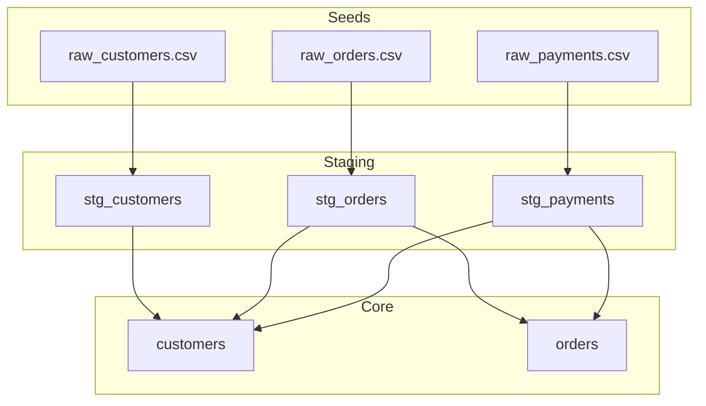

# RECONNAISSANCE: jaffle_shop

## Why this repo?
I chose `dbt-labs/jaffle_shop` because it is the canonical example for dbt projects. It contains a representative mix of SQL models, YAML configurations, and seed data (CSVs). It has a well-defined DAG that allows for clear verification of data lineage tracking, which is a core requirement of "The Brownfield Cartographer".

## The Five FDE Day-One Questions

### 1. What is the primary data ingestion path?
The primary data ingestion path is through **dbt seeds**.
- **Source Files**: `seeds/*.csv` (`raw_customers.csv`, `raw_orders.csv`, `raw_payments.csv`).
- **Implementation**: The staging models in `models/staging/` reference these seeds using the `{{ ref() }}` function.
- **Reference**: [models/staging/stg_customers.sql:7](file:///c:/Users/ruths/Desktop/TRP1/The-Brownfield-Cartographer/target_jaffle_shop/models/staging/stg_customers.sql#L7)

### 2. What are the 3-5 most critical output datasets/endpoints?
The two primary output models that serve business logic are:
1. `customers`: An aggregate table of customer information and lifetime metrics.
   - **Reference**: [models/customers.sql](file:///c:/Users/ruths/Desktop/TRP1/The-Brownfield-Cartographer/target_jaffle_shop/models/customers.sql)
2. `orders`: A flattened table of orders with payment method breakdowns.
   - **Reference**: [models/orders.sql](file:///c:/Users/ruths/Desktop/TRP1/The-Brownfield-Cartographer/target_jaffle_shop/models/orders.sql)

### 3. What is the blast radius if the most critical module fails?
The most critical module is `stg_orders`.
- **Blast Radius**: If `stg_orders` fails, the `orders` model will fail entirely, and the `customers` model will lose its order-related metrics (`first_order`, `number_of_orders`, etc.) as it depends on `stg_orders` via the `customer_orders` CTE.
- **Direct Dependents**:
  - `models/orders.sql` via `{{ ref('stg_orders') }}` at line 5.
  - `models/customers.sql` via `{{ ref('stg_orders') }}` at line 9.
- **Indirect Impact**: Downstream tests (defined in `models/staging/schema.yml` and `models/schema.yml`) would also fail.
- **Reference**: [models/customers.sql:9](file:///c:/Users/ruths/Desktop/TRP1/The-Brownfield-Cartographer/target_jaffle_shop/models/customers.sql#L9), [models/orders.sql:5](file:///c:/Users/ruths/Desktop/TRP1/The-Brownfield-Cartographer/target_jaffle_shop/models/orders.sql#L5)

### 4. Where is the business logic concentrated vs. distributed?
- **Staging Layer (`models/staging/`)**: Concentrates on technical "cleaning" and "standardization" (e.g., renaming `id` to `customer_id`, converting cents to dollars in `stg_payments`).
- **Core Layer (`models/`)**: Concentrates on business aggregations (e.g., calculating `customer_lifetime_value` in `customers.sql` and pivoting payments in `orders.sql`).
- **Reference**: Compare [stg_payments.sql:19](file:///c:/Users/ruths/Desktop/TRP1/The-Brownfield-Cartographer/target_jaffle_shop/models/staging/stg_payments.sql#L19) vs [customers.sql:57](file:///c:/Users/ruths/Desktop/TRP1/The-Brownfield-Cartographer/target_jaffle_shop/models/customers.sql#L57).

### 5. What has changed most frequently in the last 90 days?
Historically, the high-velocity core consists of the main business models:
1. `models/customers.sql` (12 commits)
2. `models/orders.sql` (High frequency)
3. `README.md` (4 commits)

## What was hardest to figure out manually?
Tracking the **lineage** across the multi-layered dbt structure (Seed -> Staging -> Core) was the most tedious part. While the project is small, manually tracing `ref()` calls across multiple files to understand the "blast radius" requires mental context-switching that a graph-based tool would solve instantly.

## Difficulty Analysis
- **Complexity**: Low-Medium. The project is small (under 20 models), which makes manual tracing possible but still annoying.
- **Opacity**: Low. dbt's conventions make the structure somewhat predictable, but the SQL logic (CTEs) can grow complex even in this "simple" example.
- **Tooling Need**: High. Even at this scale, a visual lineage graph and automated blast radius analysis would significantly speed up onboarding.
