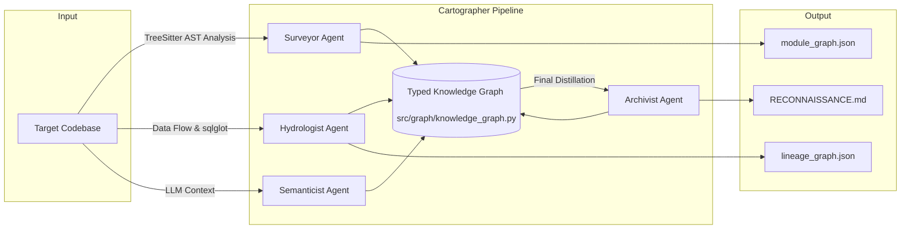

# Interim Report: The Brownfield Cartographer

**Date**: March 12, 2026  
**Status**: Mid-Phase (Phases 0, 1, 2 Complete; Rubric Alignment Verified; Phase 3 In Progress)

## 1. Reconnaissance: Manual Day-One Analysis
...
(No changes to section 1)
...
---

## 2. Architecture Diagram: Four-Agent Pipeline

The system is designed as a sequential multi-agent pipeline sharing a unified, typed Knowledge Graph storage layer.

---

## 3. Progress Summary: Component Status

| Component | Status | Functional Claim |
| :--- | :--- | :--- |
| **Knowledge Graph** | **Master** | Dedicated `KnowledgeGraph` wrapper (src/graph/) with Pydantic-typed nodes and JSON serialization/deserialization. |
| **TreeSitter Infrastructure**| **Master** | Modular `TreeSitterAnalyzer` (src/analyzers/) with centralized S-expression queries for multi-language (Py/SQL) AST extraction. |
| **Surveyor Agent** | **Master** | Constructs import graphs, calculates PageRank hubs, extracts git velocity, and flags **dead code candidates**. |
| **Hydrologist Agent**| **Master** | Merges multi-source data flow (Python, SQL via `sqlglot`, YAML) into unified lineage; supports `blast_radius` and source/sink queries. |
| **CLI & Orchestration**| **Working** | sequences Surveyor and Hydrologist agents, ensuring structural context is available for lineage analysis. |
| **Semanticist Agent**| **In Progress**| Developing LLM prompt templates and chunking strategies. |

---

## 4. Master Thinker Rubric Alignment

Following a self-audit against the "Master Thinker" criteria, the following enhancements were implemented:

1.  **Typed Storage Tier**: Moved away from ad-hoc dictionaries to a formal `KnowledgeGraph` class that bridges Pydantic models (ModuleNode, DatasetNode) to NetworkX.
2.  **Modular AST Parsing**: Decoupled AST traversal from agent logic. `TreeSitterAnalyzer` now handles language routing and structural extraction (imports, functions, classes) using strict AST queries rather than regex.
3.  **SQL Dependency Extraction**: Leveraged `sqlglot` to parse CTEs, JOINs, and complex SELECT statements, ensuring accurate lineage even in sophisticated SQL models.
4.  **Advanced Analysis**: Integrated **PageRank** to identify architectural hubs and implemented **Dead Code Detection** by analyzing in-degrees in the import graph.

---

## 5. Early Accuracy Observations
...
(No changes to section 5)
...
---

## 6. Completion Plan for Final Submission

| Sequence | Task | Dependencies | Technical Risk |
| :--- | :--- | :--- | :--- |
| **1. Phase 3** | **Semanticist Agent** | Surveyor/Hydrologist | LLM token limits when analyzing large modules. |
| **2. Phase 4** | **Archivist Agent** | All other Agents | Balancing technical detail vs. executive summary in final output. |
| **3. Final** | **Documentation & Video** | System Completion | None. |
