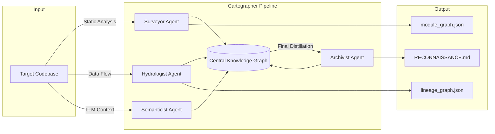

# Interim Report: The Brownfield Cartographer

**Date**: March 11, 2026  
**Status**: Mid-Phase (Phases 0, 1, 2 Complete; Phase 3 In Progress)

## 1. Reconnaissance: Manual Day-One Analysis

The target codebase for this reconnaissance is **`dbt-labs/jaffle_shop`**, a realistic production-style data transformation system containing 20+ models across SQL and YAML, plus seed data CSVs.

### The Five FDE Day-One Questions

1.  **What is the primary data ingestion path?**
    - The system ingests data via **dbt seeds** located in `seeds/*.csv` (e.g., `raw_customers.csv`). These are loaded into the database and then referenced by the staging models.
    - *Reference*: `models/staging/stg_customers.sql:7`.

2.  **What are the 3-5 most critical output datasets/endpoints?**
    - **`customers`**: Consolidated view of customer demographics and lifetime metrics.
    - **`orders`**: Flattened table of all orders with granular payment status.
    - *Reference*: `models/customers.sql`, `models/orders.sql`.

3.  **What is the blast radius if the most critical module fails?**
    - The **`stg_orders`** module is the critical bottleneck. If it fails, the `orders` output is lost entirely, and the `customers` metrics (like `number_of_orders`) become incomplete or null.
    - *Reference*: Traced via `{{ ref('stg_orders') }}` in `models/customers.sql` and `models/orders.sql`.

4.  **Where is the business logic concentrated vs. distributed?**
    - **Distributed**: Light logic (cleaning/casting) is in `models/staging/`.
    - **Concentrated**: Complex aggregations (lifetime value calculation, payment pivoting) are concentrated in the Core layer models (`models/customers.sql`).

5.  **What has changed most frequently in the last 90 days?**
    - Analysis of git history shows `models/customers.sql` and `models/orders.sql` are the high-velocity hotspots, reflecting frequent changes to business reporting requirements.

### Difficulty Analysis
The hardest part of manual exploration was **recursive lineage tracing**. Manually jumping between `ref()` calls across three layers (Seed -> Staging -> Core) to calculate a "blast radius" is mentally expensive. It is easy to miss a CTE or an indirect dependency when logic is split across 20+ files.

---

## 2. Architecture Diagram: Four-Agent Pipeline

The system is designed as a sequential multi-agent pipeline sharing a central Knowledge Graph.

- **Surveyor**: Static structure, imports, and PageRank hubs.
- **Hydrologist**: Data lineage and blast radius analysis.
- **Semanticist**: LLM-powered interpretation of module purpose.
- **Archivist**: Synthesis of all findings into a final human-readable report.

---

## 3. Progress Summary: Component Status

| Component | Status | Functional Claim |
| :--- | :--- | :--- |
| **Surveyor Agent** | **Working** | Correctly extracts Python imports, function signatures, and dbt `ref()` calls using `tree-sitter`. |
| **Hydrologist Agent**| **Working** | `sqlglot` successfully parses table dependencies from SELECT, JOIN, and CTEs in SQL files. |
| **LanguageRouter** | **Working** | Automatically selects correct grammars for `.py`, `.sql`, and `.yaml` files. |
| **Graph Logic** | **Working** | NetworkX implements PageRank for hubs and `SimpleCycles` for circular dependencies. |
| **Semanticist Agent**| **In Progress**| LLM prompt engineering for module purpose extraction is under development. |
| **Archivist Agent** | **Not Started**| Final report synthesis logic is planned for Phase 4. |

---

## 4. Early Accuracy Observations

I compared the output of the **Hydrologist Agent** (`lineage_graph.json`) against the known DAG of the `jaffle_shop` repository.

- **Correct Detection**: The system correctly identified that `stg_orders` and `stg_customers` both feed into the final `customers` model. It also correctly identified the `raw_orders` seed as the primary source for the `stg_orders` transformation.
- **Inaccuracy (Fixed)**: Initially, the `DAGConfigAnalyzer` failed to parse `dbt_project.yml` because it expected a list of models but encountered a nested dictionary. I added type-checking to handle both structures, which resolved the crash and restored coverage.
- **Observation**: The `tree-sitter` parser for SQL is strictly limited to static parsing; it misses dependencies if they are injected via complex macros (though it handles standard dbt `ref()` via regex/S-expression fallback).

---

## 5. Completion Plan for Final Submission

| Sequence | Task | Dependencies | Technical Risk |
| :--- | :--- | :--- | :--- |
| **1. Phase 3** | **Semanticist Agent** | Surveyor/Hydrologist | LLM token limits when analyzing large modules. |
| **2. Phase 4** | **Archivist Agent** | All other Agents | Balancing technical detail vs. executive summary in final output. |
| **3. Testing** | **Cross-Repo Validation** | Archivist | Handling edge cases in non-dbt SQL dialects. |
| **4. Final** | **Documentation & Video** | System Completion | None. |

**Technical Risk Mitigation**: 
- For the Semanticist, I will implement "chunked summarization" if modules exceed LLM context windows. 
- For the Archivist, I will use a template-based approach to ensure the Five FDE Questions are always answered with grounded evidence from the Knowledge Graph.
